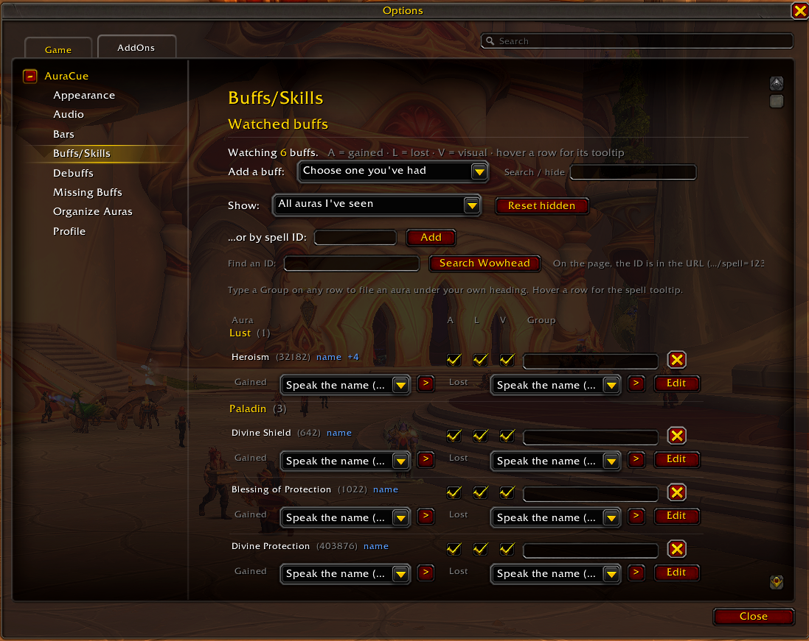
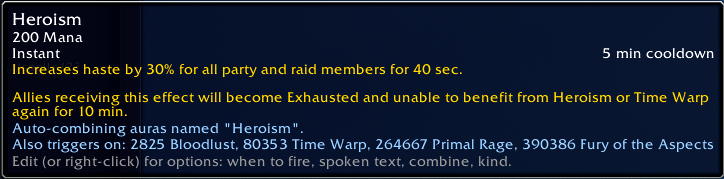
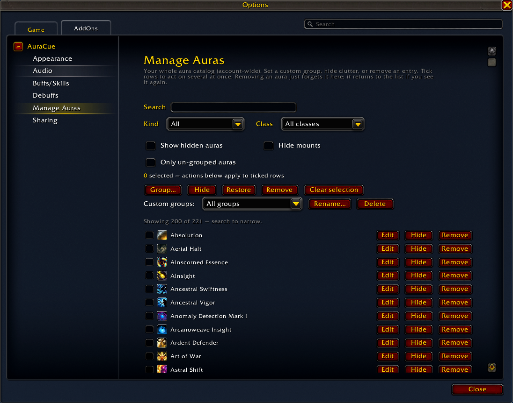
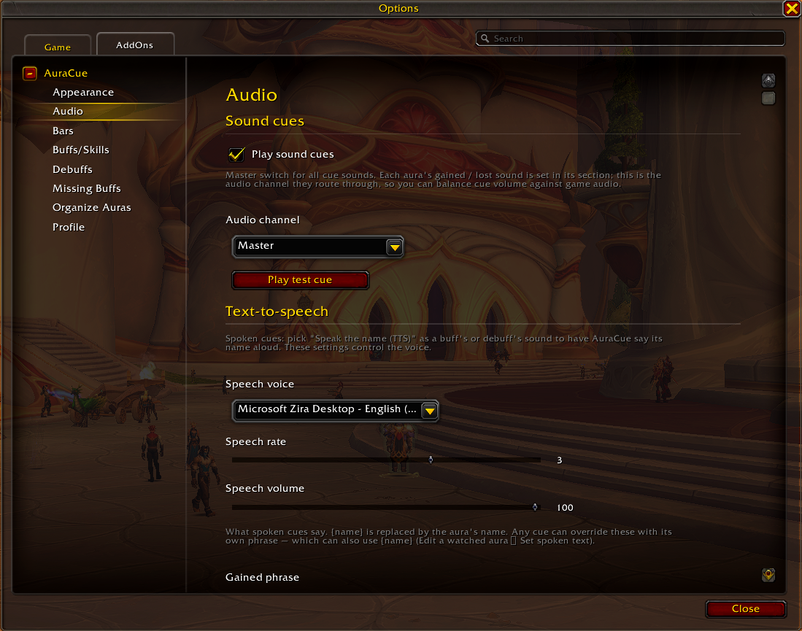
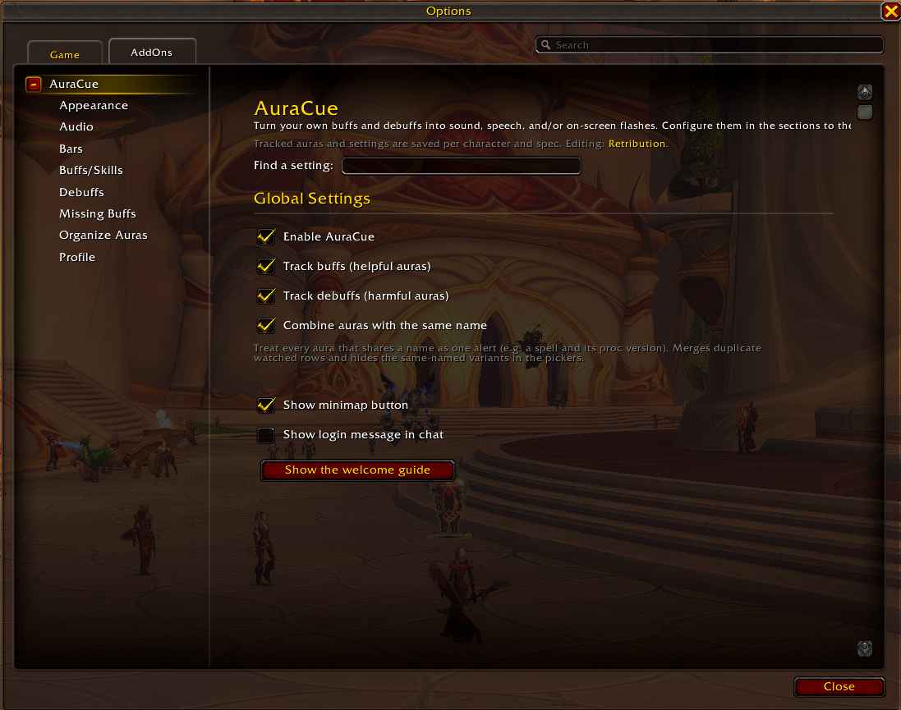
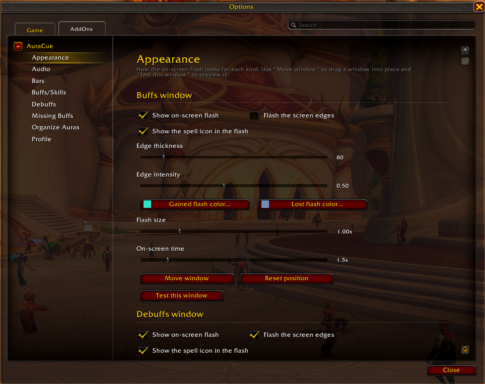
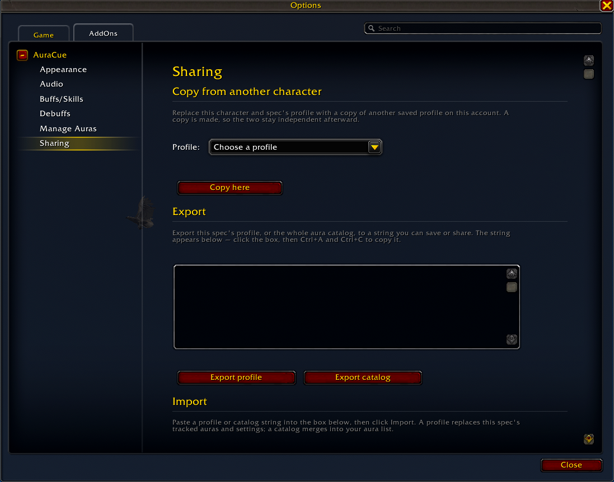

# AuraCue

A personal aura-alert addon for World of Warcraft (Midnight, 12.x). AuraCue
turns your own buffs and debuffs into a **sound**, a **spoken name**, and/or
an **on-screen flash** — for proc alerts, cooldown windows, and debuff
warnings.

Each watched aura can cue when it's **gained**, when it's **lost**, or both:

- **Sound** — a distinct bundled tone, on the audio channel you pick. Separate
  sounds for gained and lost (or "None" for silent), including matched
  open/close pairs where the gained tone rises and the lost one falls
  (rise/fall, open/close, unfold/fold, bloom/wilt).
- **Speech** — the aura's name spoken aloud (text-to-speech), with voice /
  rate / volume controls. The spoken phrase is yours to set — a general format
  like "{name} gained", or a per-aura override that can also use {name}: say
  "{name} activated", or a name-free "Damage now" the moment Bloodlust lands.
- **On-screen flash** — center text (optionally with the spell's icon) and/or a
  screen-edge glow, with separate colors for gained vs lost, and adjustable
  size, on-screen time, and edge thickness / intensity.
- **Timer bar** — an optional depleting duration bar while the aura is active
  (see [Timer bars](#timer-bars)).

Buffs and debuffs each get their own on-screen window (size, colors, position,
duration), configured on the **Appearance** page; sound and speech options live
on the **Audio** page. Every watched row has an
**Edit** button (or right-click it) for that aura's options: a **When**
condition — fire everywhere, only in combat, only in instances, or only in the
open world — its spoken text, whether it's treated as a buff or a debuff,
combining (below), a **timer bar** toggle, and a **Require another aura**
condition that only fires the cue while some other aura is active (or missing) —
with its own override text.

## Screenshots

**Buffs / Skills — the watched list.** Each aura has gained/lost sound
dropdowns and a per-row **Edit** menu:

**One alert, many spell IDs.** Heroism auto-combined with its cross-class
equivalents — Bloodlust, Time Warp, Primal Rage, and Fury of the Aspects:

**Organize Auras — filter and bulk-edit the whole catalog:**

**Audio — channel plus text-to-speech voice and phrases:**

More pages — Global Settings, Appearance, Profile

## Working in instances

Midnight (patch 12.0) hides combat data from addons behind "secret values"
during raids, Mythic+, delves, and PvP — which is why broad trackers lost much
of their coverage. AuraCue is built around that wall instead of fighting it:

- It only ever tracks **your own** auras and casts, which stay available.
- Buffs you **cast** are tracked from the cast event (non-secret in instances),
  so their cues fire there even when the aura itself can't be read.
- Debuffs that land on you in instances are surfaced through the game's
  **private-aura applied sound**, so a debuff's Gained sound still plays.
- Every value it reads is guarded, so it never errors on a masked one.

> **⚠️ Not every ability is trackable in combat.** Inside raids, Mythic+,
> delves, and PvP the game hides auras addons aren't allowed to read. AuraCue
> still cues the buffs *you* cast and plays a sound for debuffs that land on
> you — but an aura that simply appears on you **without a cast you made** (a
> proc, or a buff someone else puts on you) can't be tracked in that combat and
> will only cue out in the open world. Out of instances, everything works.

## The aura picker

You build your watch list from a catalog AuraCue fills in for you. Your class's
abilities are **pre-loaded from your spellbook** the instant you log in, so the
picker is useful immediately — and it keeps growing as you play, adding every
aura it sees on you plus every ability you cast. The catalog is account-wide,
so logging into each character folds in that class's spells. You rarely have to
hunt for spell IDs (though you still can add one by ID).

Castable abilities count too, even ones that apply no aura of their own — they
cue when *you* cast them (handy for cooldown reminders), which is why that page
is named **Buffs/Skills**.

**No hard-coded ability list.** AuraCue has no built-in whitelist or blacklist
of spells — it learns purely from what it observes you cast and what lands on
you. This is by design: any aura works once it has been seen a single time,
including brand-new or reworked abilities from a patch, with nothing on the
addon's side to update or wait for.

It also never hides or filters abilities on its own — everything it has seen
stays in the catalog. **Any hiding is your choice** (the ✕ on a picker entry, or
Organize Auras), and anything you hide can be restored at any time.

- **Grouped submenus.** Buffs group under **your class** (e.g. abilities your
  Shaman casts → "Shaman"), **Mounts**, **From you / your pet**, and **World &
  other**. Debuffs group under **Boss**, the **dungeon** they came from, or
  **Other**. You can also file any aura under a **custom group** of your own.
- **Filters** (the "Show" dropdown) combine to thin a big list: only abilities
  you know, only boss auras, only role-relevant auras, only permanent or only
  timed, hide mounts, only ungrouped, and so on. Already-tracked auras are
  always left out.
- **Search / hide.** Click the search box to see your auras; the ✕ hides an
  aura you don't want (account-wide), the note icon files it into a group, and
  with "Show hidden auras" on you can restore one with the **+**.
- **Find an ID → Search Wowhead.** Type a spell name to get a copyable Wowhead
  search link (addons can't browse the web), where the ID is in the URL.

## Combining variants into one alert

Some abilities have more than one form with different spell IDs — e.g. a base
spell and its talented proc version. AuraCue can treat them as one cue:

- **Combine auras with the same name** (a Global Setting) makes every
  same-named aura drive a single alert and merges duplicate rows.
- Or a watched row's **Edit** menu lets you combine just that one by name, or
  add specific extra spell IDs by hand.

## Timer bars

Any watched aura can show an optional on-screen **duration bar** while it's
active — turn it on from that aura's **Edit** menu ("Show a timer bar while
active"), or force a bar on every buff / debuff from the **Bars** page. Bars
share one movable window and can use any **LibSharedMedia** bar texture and
font; you can set the bar colors (per buff / debuff), text outline / shadow,
fill direction, icon side, and growth direction, and the countdown rounds up to
minutes / hours for long buffs.

## Missing-buff checklist

The **Missing Buffs** page builds a list of the buffs you want kept up; a
movable on-screen box then shows an icon for each one that **isn't** currently
on you — an empty box means you're fully buffed, handy as a pre-pull check.
Temporary weapon enchants (oils / sharpening stones) aren't auras, so they get
their own "warn if missing" row. Per item you can also tick **Flash** (a pulsing
screen-edge glow, in a color you choose, while it's missing) and **Ticker** (a
scrolling marquee of the missing names). Matching is by name, so a different
rank of the same flask still counts as present.

## Managing the catalog

The **Organize Auras** page is a full edit view of your account-wide catalog:
search and filter it (by kind, class, custom group, hidden, mounts, or only
ungrouped), set a custom group, hide or show entries, or remove them — one at a
time or in bulk by ticking rows. Each row's **Edit** dialog adjusts the finer
stored details
(group, class, dungeon, buff/debuff). Removing an aura just forgets it until you
see it again.

## Profiles, presets & sharing

Settings are saved **per character and specialization**, so each spec keeps its
own watch list and windows. The **Profile** page can:

- Save the current setup as a named, account-wide **preset** and apply it to any
  spec later — for quickly switching between raid, Mythic+, and PvP setups (also
  via `/cue preset`).
- **Copy a profile from another character/spec** on your account directly (no
  string needed).
- **Export / import** the current spec's profile, or the whole aura catalog, as
  a copy-paste string.

The catalog is account-wide (shared across all your characters).

## Usage

Open options with `/cue` (or `/auracue`), the minimap button, or the addon
compartment.

| Command | Does |
| --- | --- |
| `/cue` | Open the options panel |
| `/cue add <id>` / `/cue remove <id>` | Watch / unwatch an aura by spell ID |
| `/cue list` | List watched auras |
| `/cue test` | Preview a cue |
| `/cue toggle` | Enable / disable |
| `/cue unlock` (`move`) / `/cue lock` | Move / lock the on-screen window |
| `/cue reset` | Reset on-screen positions |
| `/cue preset <name>` | Apply a saved profile preset (`save`/`list`/`delete`) |
| `/cue gather` | Catalog auras on nearby units (target, focus, party, …) |
| `/cue forget` | Clear the remembered-aura catalog |
| `/cue tts` | Diagnose text-to-speech |
| `/cue status` | Print current settings |
